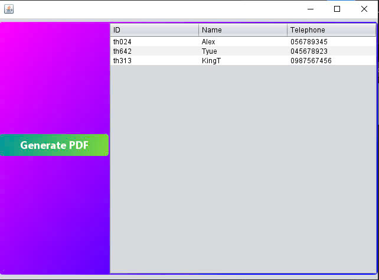

# GeneratePDF-Java


[](http://www.java2s.com/Code/Jar/i/Downloaditext148jar.htm)


[](https://github.com/KangDagyeom/GeneratePDF-Java/issues)


## Employee PDF Generator
This is a simple Java application that generates a PDF file containing employee information. The application retrieves data from a table and saves it to a PDF file.



## Features
Export employee data (ID, Name, Telephone) to a PDF file.
User-friendly interface with file-saving options.
Uses JFileChooser to let users select the save location.

*Requirements*
```
Java Development Kit (JDK) 8 or higher.
```

**External libraries:**
```
iText (for PDF generation).
```

**Installation**
Clone this repository:
```
git clone https://github.com/your-username/employee-pdf-generator.git
cd employee-pdf-generator
```
Import the project into your IDE (e.g., NetBeans, IntelliJ IDEA, Eclipse).

**Add the iText library to your project:**
Download the iText JAR file from Maven Repository.
Add the JAR to your project's classpath.

# How to Use

Run the application from your IDE or export it as a runnable JAR file.

**Populate the employee table with data:**

You can add employee details directly in the table interface.
Click the Export to PDF button.

A dialog will prompt you to select the save location for the PDF file:

Choose a folder and name your file (e.g., employee_list.pdf).
After saving, you will see a success message, and the PDF file will be generated in the selected location.

## Example Output
The PDF will include a table with the following columns:


## Troubleshooting
```
FileNotFoundException: Ensure you have permission to write files in the selected directory.
```
```
No PDF generated: Verify that the iText library is added to your project.
```
```
Incomplete data: Check if all table rows are correctly populated.
```
## Contributing
If you'd like to contribute:

## Fork the repository.
Create a new branch:```git checkout -b feature-name.```
Commit your changes:```git commit -m "Added feature".```
Push the branch: ```git push origin feature-name.```

## Open a pull request.

License
This project is licensed under the MIT License.

